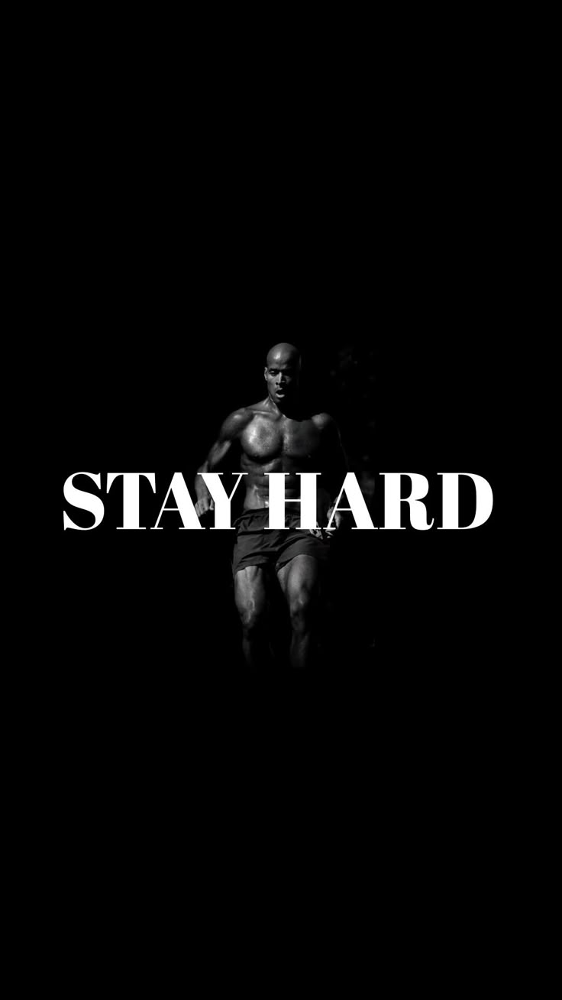

# Kamal Sing Bhumij

  

---

## About Me

**Computer Science Graduate** with hands-on experience in web development and a passion for building impactful applications.

- 💻 Full-Stack Developer specializing in **MERN Stack**
- 👨‍🏫 Web Development TA at **Jainemo Private Limited**
- 🎓 **BCA Graduate** from Assam Down town University _(CGPA: 8.49)_
- 🚀 Currently exploring **WebRTC** and **Real-time Applications**
- 💡 Love creating **real-world solutions**
- 🏀 **Mamba Mentality** - Obsessed with continuous improvement
- 💪 **Never Finished** - Always pushing beyond limits

  

---

## Tech Stack

  

---

## Projects

### 🏨 **LushStay**

Full-stack accommodation booking platform with dynamic filtering and responsive design.  
**Tech:** React, Node.js, MongoDB, Express  
[View Code →](https://github.com/KAmaL-senpai/LushStay)

### 📈 **SwiftTrade**

Stock portfolio management system with real-time tracking and interactive charts.  
**Tech:** React, Node.js, Express, MongoDB, Chart.js  
[View Code →](https://github.com/KAmaL-senpai/SwiftTrade)

### 🎥 **WebRTC Connect**

Real-time video conferencing application with peer-to-peer communication.  
**Tech:** WebRTC, Socket.IO, React  
[View Code →](https://github.com/KAmaL-senpai/WebRTC-Connect)

---

## GitHub Stats

  
  

  

---

   

---

## Connect

  

**The job's not finished.** 💜

---

  

